# The lab is for learning some tools for monitoring.

  

## ⚙️ Introduction.

This lab has the objective of testing different tools for monitoring. 

## 🛠 Stack.

<ol>
  <li>Java</li>
  <li>Spring</li>
  <li>Spring boot</li>
  <li>Docker</li>
  <li>Docker Compose</li>
  <li>OpenTelemetry</li>
  <li>Grafana</li>
  <li>Prometheus</li>
  <li>Jaeger</li>
  <li>PostgreSQL</li>
  <li>Dbeaver</li>
  <li>Postman</li>
  <li>Intellij</li>
  <li>VsCode</li>
</ol>

## ⚙️ General Architecture.

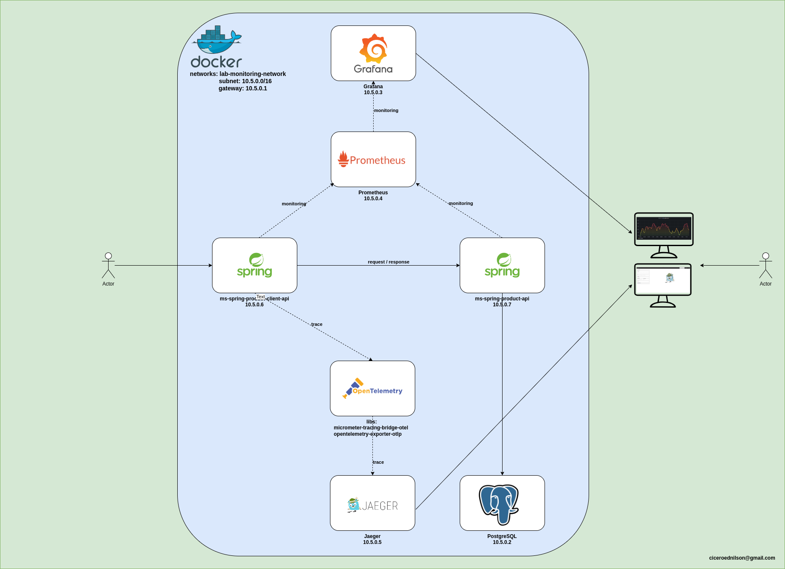

## ⚙️ Create a Docker image for ms-spring-product-api.

source: [ms-spring-product-api](ms-spring-product-api)

This service is responsible for the CRUD operations of products.

Below is the command to create a Docker image.

~~~~shell
sudo docker build -f Dockerfile -t img-ms-spring-product-api .
~~~~

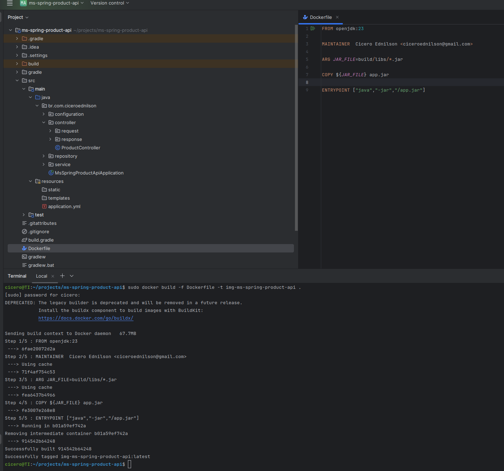

## ⚙️ Create a Docker image for ms-spring-product-client-api.

source: [ms-spring-product-client-api](ms-spring-product-client-api)

This service is responsible for the call operations of products.

Below is the command to create a Docker image.

~~~~shell
sudo docker build -f Dockerfile -t img-ms-spring-product-client-api .
~~~~

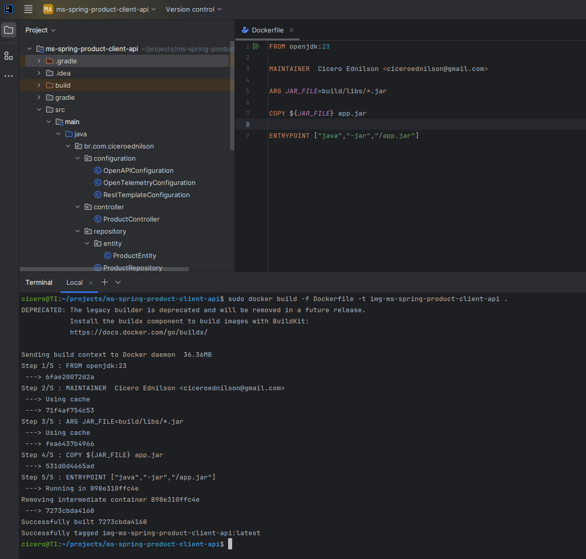

## ⚙️ Setting up Prometheus through the prometheus.yml file.

source: [prometheus.yml](docker-compose/prometheus.yml)
 
In this file, we configure the endpoints to capture metrics.

~~~~yml
global:
  scrape_interval: 15s  # The default scrape interval (how often Prometheus scrapes data)

# The scrape configuration specifies the target services that Prometheus will scrape.
scrape_configs:
  - job_name: 'prometheus'  # A job name for Prometheus itself
    static_configs:
      - targets: ['10.5.0.4:9090']  # Scrape Prometheus metrics itself (Prometheus UI)

  - job_name: 'grafana'  # Example of scraping Grafana
    static_configs:
      - targets: ['10.5.0.3:3000']  # Replace with the address of your Grafana instance

  - job_name: 'ms-spring-product-api'  # application
    metrics_path: '/actuator/prometheus'
    static_configs:
      - targets: ['10.5.0.6:8001']  # Replace with your application's metrics endpoint
  
  - job_name: 'ms-spring-product-client-api'  # application
    metrics_path: '/actuator/prometheus'
    static_configs:
      - targets: ['10.5.0.7:7001']  # Replace with your application's metrics endpoint
~~~~

## ⚙️ Docker Compose to create all the containers that we need to use.

source: [docker-compose.yml](docker-compose/docker-compose.yml)

~~~~yml
version: '3.9'

services:
  db:
    image: postgres
    networks:
      lab-monitoring-network:
        ipv4_address: 10.5.0.2
    restart: always
    ports:
      - 5432:5432    
    shm_size: 128mb    
    environment:
      POSTGRES_USER: postgres
      POSTGRES_PASSWORD: 123456

  grafana:
    image: grafana/grafana:latest
    container_name: grafana
    user: "472:472"  # Run as the Grafana user
    ports:
      - "3000:3000"
    environment:
      GF_SECURITY_ADMIN_PASSWORD: "123456"
    volumes:
      - grafana_lab_data:/var/lib/grafana
    networks:
      lab-monitoring-network:
        ipv4_address: 10.5.0.3
    restart: always
  
  prometheus:
    image: prom/prometheus:latest
    container_name: prometheus
    ports:
      - "9090:9090"
    volumes:
      - ./prometheus.yml:/etc/prometheus/prometheus.yml
    networks:
      lab-monitoring-network:
        ipv4_address: 10.5.0.4

  jaeger:
    image: jaegertracing/jaeger:2.2.0
    container_name: jaeger    
    ports:
      - "16686:16686" # the jaeger UI 
      - "4317:4317" # the OpenTelemetry collector grpc 
    environment:
      - COLLECTOR_OTLP_ENABLED=true
    networks:
      lab-monitoring-network:
        ipv4_address: 10.5.0.5
    restart: always

  # api products
  ms-spring-product-api:
    image: img-ms-spring-product-api
    ports:
      - "8001:8001"
    networks:
      lab-monitoring-network:
        ipv4_address: 10.5.0.6

  # api products client
  ms-spring-product-client-api:
    image: img-ms-spring-product-client-api
    ports:
      - "7001:7001"
    networks:
      lab-monitoring-network:
        ipv4_address: 10.5.0.7

networks:
  lab-monitoring-network:
    driver: bridge
    ipam:
      config:
        - subnet: 10.5.0.0/16
          gateway: 10.5.0.1

volumes:
  grafana_lab_data:
~~~~

## ⚙️ Execute Docker Compose.

We need to execute Docker Compose to create our containers.

~~~~shell
sudo docker-compose up -d --build
~~~~

After executing the command, you can see the result below.

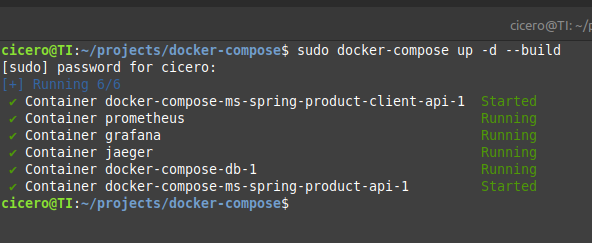

## ⚙️ Creating the database in PostgreSQL.

Data Base: db_system
User: postgres
Password: 123456

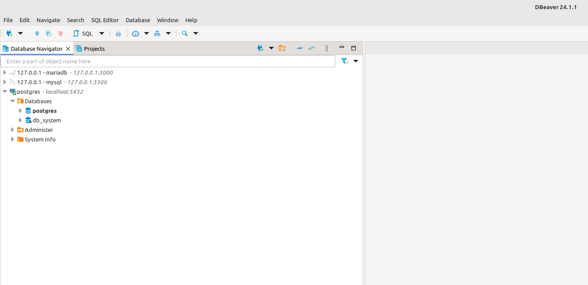

After creating the database, we need to restart the container img-ms-spring-product-api because a connection error occurred with the database since it did not exist yet.

Find the container and restart.
~~~~shell
sudo docker container ps -a

ID             IMAGE  
28f149949462   img-ms-spring-product-api

sudo docker container restart 28f149949462
~~~~

## ⚙️ Swagger for the ms-spring-product-api service.

url: http://localhost:8001/swagger-ui/index.html

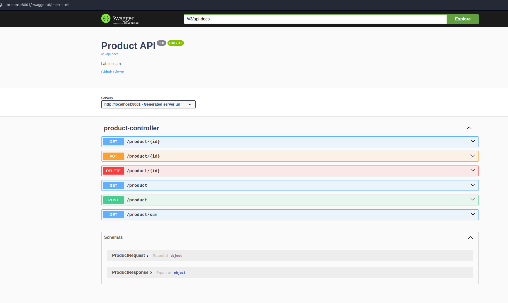

## ⚙️ Swagger for the ms-spring-product-client-api service.

url: http://localhost:7001/swagger-ui/index.html

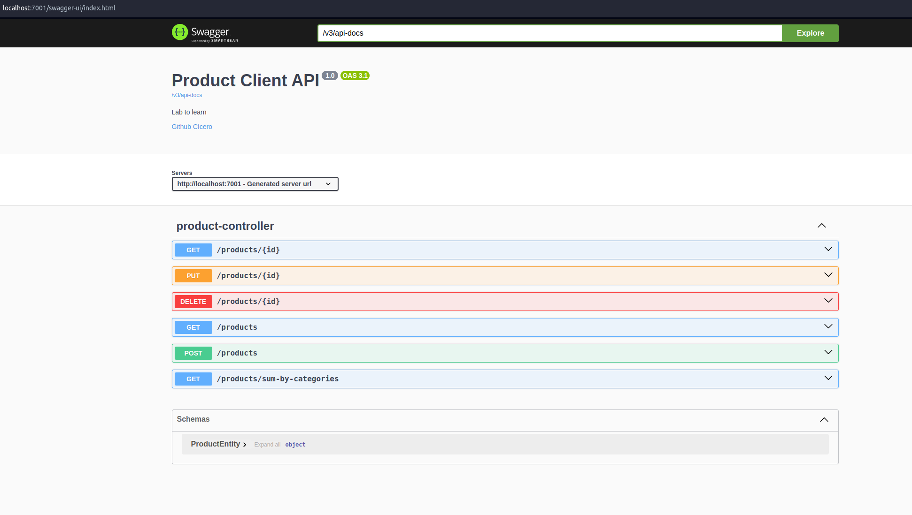

## ⚙️ Prometheus Metrics.

url: http://localhost:9090/query

1
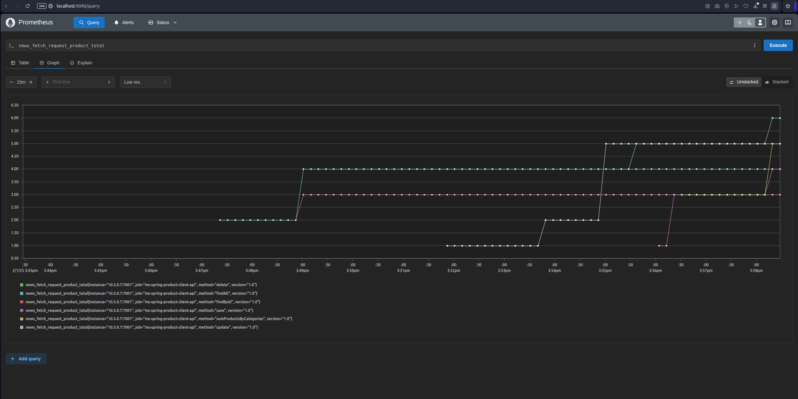

2
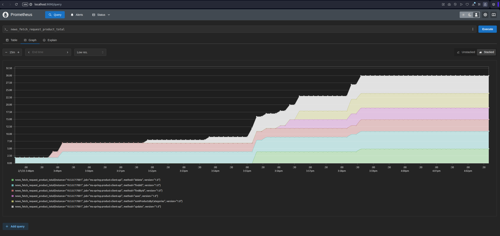

3
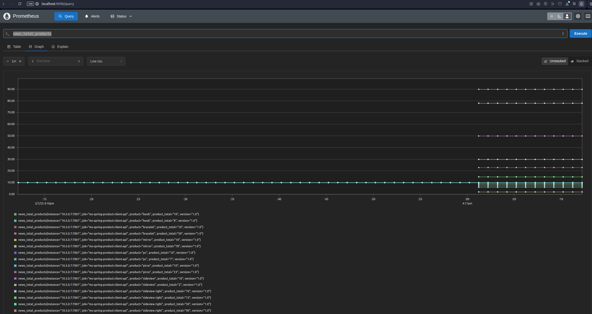

## ⚙️ Grafana Metrics.

Url:http://localhost:3000/login
User: admin
Password: 123456

1 - Login.
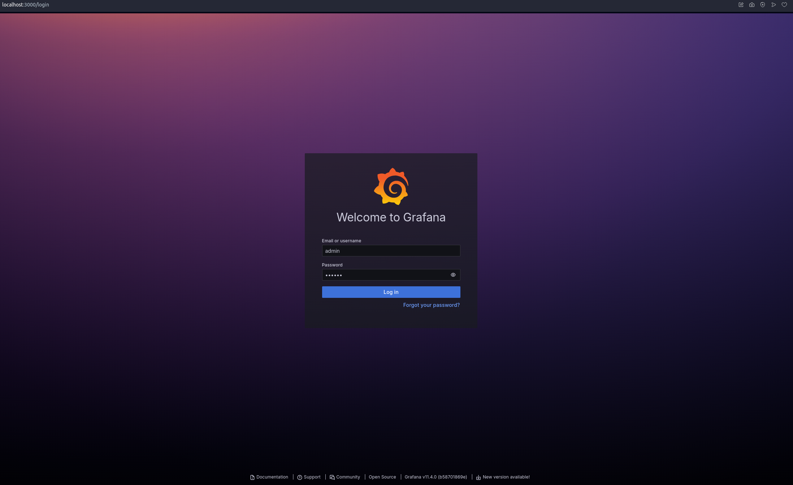

2 - Configuring Prometheus in Grafana.
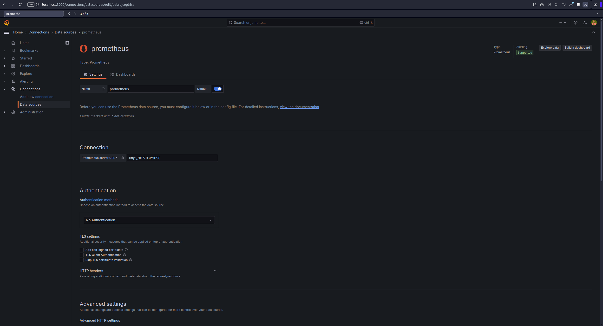

3 - Creating a dashboard in Grafana..
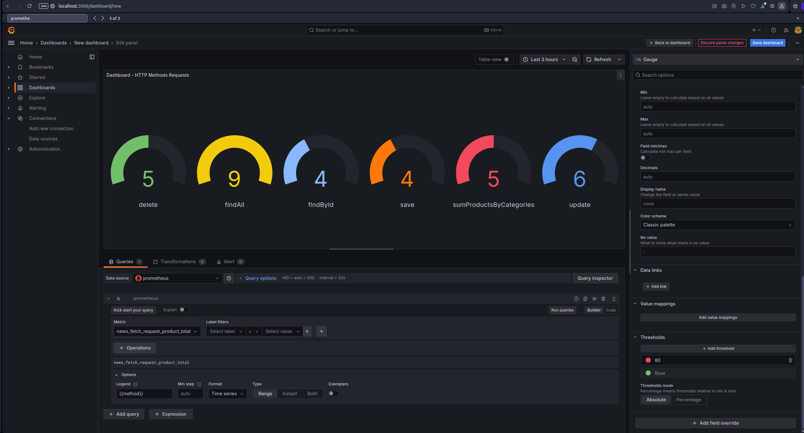

4 - Dashboard for Products and Services.
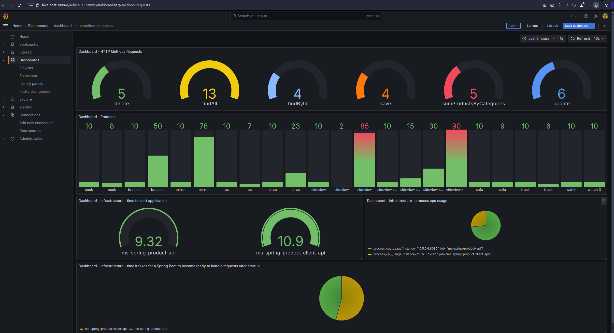

## ⚙️ Jaeger Traces.

1 - Find the trace by service name.
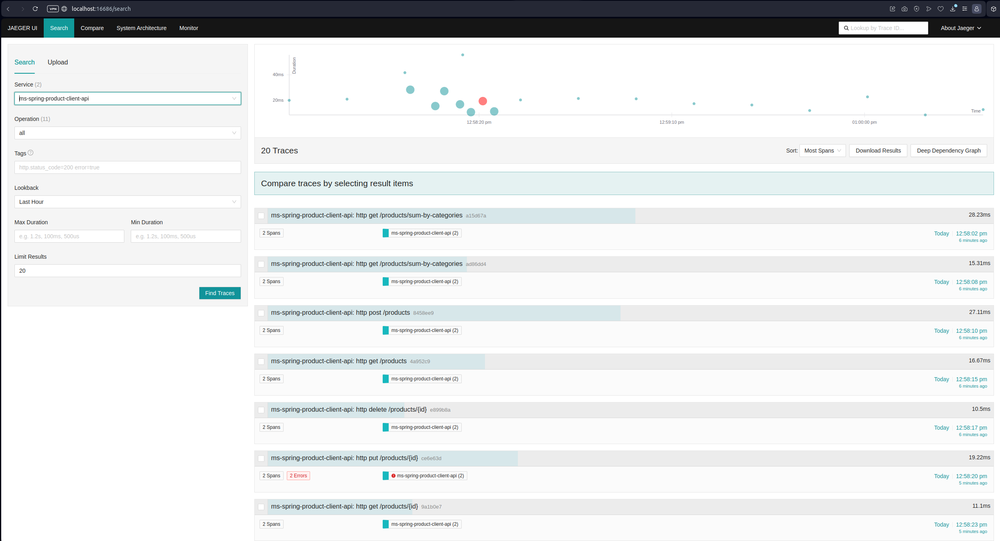

2 - Trace details of an execution that calls another service.
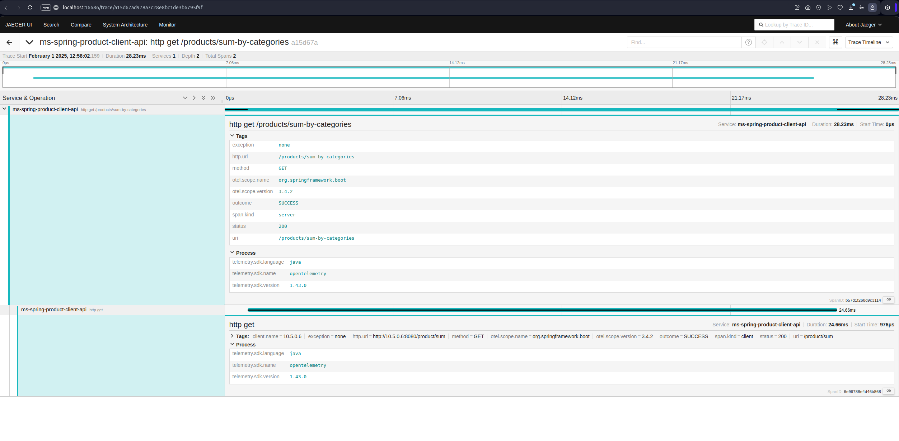

3 - Trace details when any error occurs while calling another service.
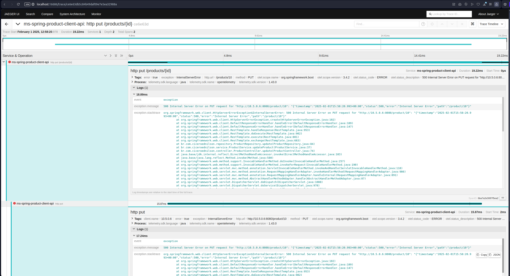

## 📌 Version.

1.0

## ✒️ Author.

Cícero Ednilson - ciceroednilson@gmail.com